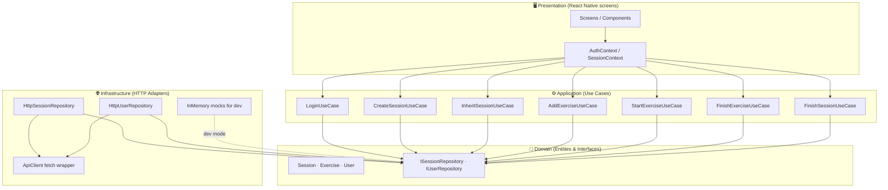
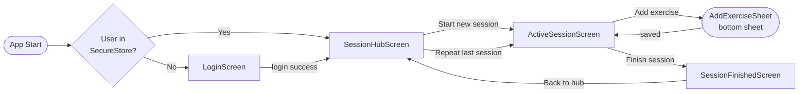
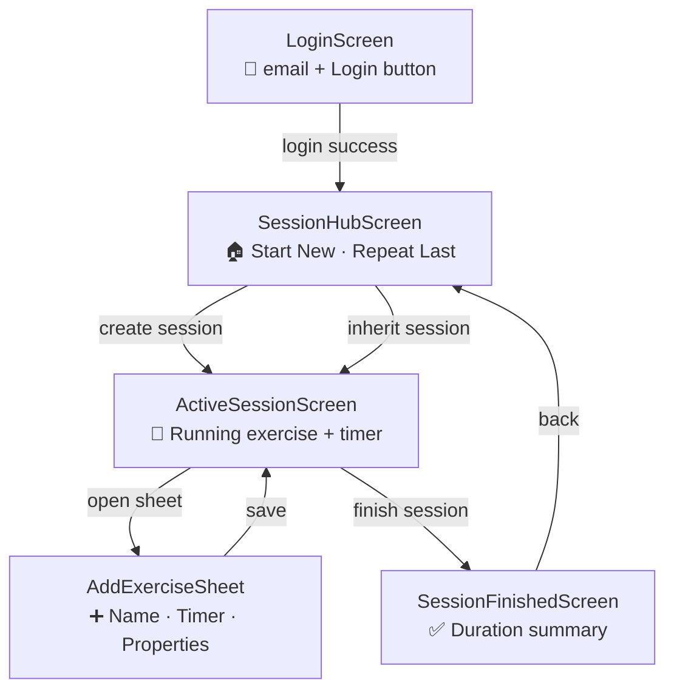
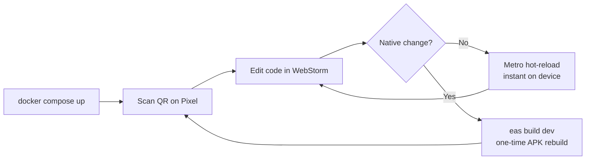

# Task

## Intro

- The app is a primary client (Native React / Expo / TypeScript) of RESTful Architecture (see the server openapi.yaml) designed according to DDD and Clean Design that provides High-Scent Navigation UI for typical fitness workflow

- At first, the app supports (Training) Session Tracking (Core) Bounded Context and User Management (Generic) Context, see the OpenApi.

- The primary use cases are:
    - LogIn (Authentication)
    - Create new or inherit a Training Session.
    - Create or choose / edit existing Exercises and (optionally) finish them
    - Finish the Session

# gym-andr — Development Plan

> **React Native · Expo · TypeScript · DDD · Clean Architecture**
> Project path: `c:\DWP\github\gym-api\gym-andr`
> IDE: WebStorm · Device: Pixel phone · Backend: Kiss Gym API (see `openapi.yaml`)

---

## Overview

The app is the primary mobile client of the **Kiss Gym RESTful API**, designed according to **DDD** and **Clean Architecture** principles. It provides a **High-Scent Navigation UI** for the typical gym workflow.

### Bounded Contexts (v1)

| Context | Type | Use Cases |
|---|---|---|
| Training Session Tracking | Core | Create/Inherit session, Add/Start/Finish exercise, Finish session |
| User Management | Generic | Register, Login, Get current user |

### Design Principles

- **DDD** — Domain model is the heart; infrastructure adapts to it, never the other way around
- **Clean Architecture** — Strict layer dependency: domain ← application ← infrastructure ← presentation
- **SOLID** — Especially Dependency Inversion: UI and HTTP depend on interfaces, not concretions
- **YAGNI** — No Redux, no Axios, no IoC container until actually needed
- **KISS** — `fetch()` over Axios, `Context + useReducer` over Redux, simple `ServiceLocator` over DI framework

---

## Architecture Overview



---

## Navigation Flow



---

## Folder Structure

```
src/
├── domain/
│   ├── session/
│   │   ├── Session.ts                ← aggregate root entity
│   │   ├── Exercise.ts               ← entity
│   │   ├── ExerciseProperty.ts       ← value object
│   │   ├── ExerciseStatus.ts         ← value object enum: Pending | Running | Finished
│   │   └── ISessionRepository.ts     ← repository interface (contract)
│   └── user/
│       ├── User.ts                   ← entity
│       └── IUserRepository.ts        ← repository interface (contract)
│
├── application/
│   ├── session/
│   │   ├── CreateSessionUseCase.ts
│   │   ├── InheritSessionUseCase.ts
│   │   ├── AddExerciseUseCase.ts
│   │   ├── StartExerciseUseCase.ts
│   │   ├── FinishExerciseUseCase.ts
│   │   └── FinishSessionUseCase.ts
│   └── user/
│       └── LoginUseCase.ts
│
├── infrastructure/
│   ├── api/
│   │   └── ApiClient.ts              ← thin fetch() wrapper, auth header injection
│   ├── session/
│   │   ├── HttpSessionRepository.ts  ← implements ISessionRepository
│   │   └── InMemorySessionRepository.ts  ← mock for offline dev
│   └── user/
│       ├── HttpUserRepository.ts     ← implements IUserRepository
│       └── InMemoryUserRepository.ts ← mock for offline dev
│
├── presentation/
│   ├── navigation/
│   │   └── RootNavigator.tsx         ← stack + auth guard
│   ├── context/
│   │   ├── AuthContext.tsx           ← user | null, isLoading
│   │   └── SessionContext.tsx        ← currentSession, exercises[], reducer
│   └── screens/
│       ├── LoginScreen.tsx
│       ├── SessionHubScreen.tsx
│       ├── ActiveSessionScreen.tsx
│       ├── AddExerciseSheet.tsx      ← bottom sheet
│       └── SessionFinishedScreen.tsx
│
└── ServiceLocator.ts                 ← DI wiring, swaps HTTP ↔ InMemory via ENV
```

---

## Phase 1 — Project Bootstrap & Toolchain

**Goal:** Init the Expo project, configure Docker, connect your Pixel phone.

### Step 1.1 — Create the Expo project

```bash
cd c:\DWP\github\gym-api
npx create-expo-app@latest gym-andr --template blank-typescript
```

Recommended `tsconfig.json` additions:

```json
{
  "compilerOptions": {
    "strict": true,
    "baseUrl": ".",
    "paths": {
      "@domain/*": ["src/domain/*"],
      "@application/*": ["src/application/*"],
      "@infrastructure/*": ["src/infrastructure/*"],
      "@presentation/*": ["src/presentation/*"]
    }
  }
}
```

### Step 1.2 — Port the Docker Compose

Update `compose.yaml` from `expo-android-test`, adjusting the volume path:

```yaml
services:
  expo:
    image: node:lts-slim
    working_dir: /app
    volumes:
      - ../gym-andr:/app
    ports:
      - "8081:8081"
      - "19000:19000"
    environment:
      - EXPO_DEVTOOLS_LISTEN_ADDRESS=0.0.0.0
      - REACT_NATIVE_PACKAGER_HOSTNAME=192.168.0.164   # ← your LAN IP
      - EXPO_NO_DEVTOOLS=1
    tty: true
    stdin_open: true
    command: /bin/sh -c "npm install && npx --yes expo start --lan --dev-client"

  gradle:
    image: reactnativecommunity/react-native-android
    working_dir: /app/android
    volumes:
      - ../gym-andr:/app:z
      - gradle-cache:/root/.gradle
      - android-sdk-cache:/opt/android-sdk
    command: tail -f /dev/null

volumes:
  gradle-cache:
  android-sdk-cache:
```

### Step 1.3 — Install expo-dev-client (one-time APK)

```bash
npx expo install expo-dev-client
```

Build the dev-client APK once via the gradle container — all subsequent JS changes will be delivered **over-the-air** without reinstalling.

```bash
# Inside the gradle container
./gradlew assembleDebug

# Install on Pixel via adb
adb install android/app/build/outputs/apk/debug/app-debug.apk
```

### Step 1.4 — WebStorm Setup

- Enable ESLint + Prettier with strict TypeScript
- Add a **Run Configuration**: `docker compose up expo`
- Install the **Expo Tools** plugin if available
- Use path aliases (`@domain/`, `@application/`, etc.) configured via `babel-plugin-module-resolver`

```bash
npx expo install babel-plugin-module-resolver
```

---

## Phase 2 — Clean Architecture Folder Structure

**Goal:** Establish DDD layers before writing any feature code. This is the most important phase.

### Step 2.1 — Domain Entities

```typescript
// src/domain/session/ExerciseStatus.ts
export type ExerciseStatus = 'Pending' | 'Running' | 'Finished';

// src/domain/session/ExerciseProperty.ts  (Value Object)
export interface ExerciseProperty {
  readonly name: string;
  readonly value: string;
}

// src/domain/session/Exercise.ts
export interface Exercise {
  readonly id: string;
  readonly autoLabel: string;
  readonly photoUrl?: string;
  readonly startedAt?: Date;
  readonly maxEndAt?: Date;
  readonly realEndAt?: Date;
  readonly status: ExerciseStatus;
  readonly properties: ExerciseProperty[];
}

// src/domain/session/Session.ts
export type SessionStatus = 'Active' | 'Finished';

export interface Session {
  readonly id: string;
  readonly userId: string;
  readonly createdAt: Date;
  readonly finishedAt?: Date;
  readonly status: SessionStatus;
  readonly inheritedFromSessionId?: string;
  readonly exercises: Exercise[];
}

// src/domain/user/User.ts
export interface User {
  readonly id: string;
  readonly email: string;
  readonly name: string;
}
```

### Step 2.2 — Repository Interfaces

```typescript
// src/domain/session/ISessionRepository.ts
import { Session } from './Session';
import { Exercise } from './Exercise';

export interface AddExerciseInput {
  autoLabel: string;
  photoUrl?: string;
  maxEndAt?: Date;
  properties?: { name: string; value: string }[];
}

export interface ISessionRepository {
  create(userId: string, inheritFromSessionId?: string): Promise<Session>;
  getById(sessionId: string): Promise<Session>;
  finish(sessionId: string): Promise<Session>;
  addExercise(sessionId: string, input: AddExerciseInput): Promise<Exercise>;
  startExercise(sessionId: string, exerciseId: string, maxEndAt?: Date): Promise<Exercise>;
  finishExercise(sessionId: string, exerciseId: string): Promise<Exercise>;
  deleteExercise(sessionId: string, exerciseId: string): Promise<void>;
}

// src/domain/user/IUserRepository.ts
import { User } from './User';

export interface IUserRepository {
  login(email: string): Promise<User>;
  register(email: string, name: string): Promise<User>;
  getMe(): Promise<User>;
}
```

### Step 2.3 — Use Case Skeletons

```typescript
// src/application/session/CreateSessionUseCase.ts
import { ISessionRepository } from '@domain/session/ISessionRepository';
import { Session } from '@domain/session/Session';

export class CreateSessionUseCase {
  constructor(private readonly sessionRepo: ISessionRepository) {}

  async execute(userId: string): Promise<Session> {
    return this.sessionRepo.create(userId);
  }
}

// src/application/session/InheritSessionUseCase.ts
export class InheritSessionUseCase {
  constructor(private readonly sessionRepo: ISessionRepository) {}

  async execute(userId: string, inheritFromSessionId: string): Promise<Session> {
    return this.sessionRepo.create(userId, inheritFromSessionId);
  }
}

// Pattern is identical for: AddExerciseUseCase, StartExerciseUseCase,
// FinishExerciseUseCase, FinishSessionUseCase, LoginUseCase
```

---

## Phase 3 — Infrastructure: API Client Layer

**Goal:** Implement HTTP adapters. Zero business logic here — thin translators only.

### Step 3.1 — API Client

```typescript
// src/infrastructure/api/ApiClient.ts
const BASE_URL = process.env.EXPO_PUBLIC_API_URL ?? 'http://192.168.0.164:5000';

let authToken: string | null = null;
export const setAuthToken = (token: string | null) => { authToken = token; };

export async function apiRequest<T>(
  path: string,
  options: RequestInit = {}
): Promise<T> {
  const headers: Record<string, string> = {
    'Content-Type': 'application/json',
    ...(authToken ? { Authorization: `Bearer ${authToken}` } : {}),
  };
  const res = await fetch(`${BASE_URL}${path}`, { ...options, headers });
  if (!res.ok) {
    const err = await res.json().catch(() => ({}));
    throw new Error(err.detail ?? `HTTP ${res.status}`);
  }
  return res.status === 204 ? (undefined as T) : res.json();
}
```

### Step 3.2 — HttpSessionRepository

```typescript
// src/infrastructure/session/HttpSessionRepository.ts
import { apiRequest } from '../api/ApiClient';
import { ISessionRepository, AddExerciseInput } from '@domain/session/ISessionRepository';
import { Session } from '@domain/session/Session';
import { Exercise } from '@domain/session/Exercise';

export class HttpSessionRepository implements ISessionRepository {
  async create(userId: string, inheritFromSessionId?: string): Promise<Session> {
    return apiRequest('/api/sessions', {
      method: 'POST',
      body: JSON.stringify({ userId, inheritFromSessionId }),
    });
  }

  async getById(sessionId: string): Promise<Session> {
    return apiRequest(`/api/sessions/${sessionId}`);
  }

  async finish(sessionId: string): Promise<Session> {
    return apiRequest(`/api/sessions/${sessionId}/finish`, { method: 'POST' });
  }

  async addExercise(sessionId: string, input: AddExerciseInput): Promise<Exercise> {
    return apiRequest(`/api/sessions/${sessionId}/exercises`, {
      method: 'POST',
      body: JSON.stringify(input),
    });
  }

  async startExercise(sessionId: string, exerciseId: string, maxEndAt?: Date): Promise<Exercise> {
    return apiRequest(`/api/sessions/${sessionId}/exercises/${exerciseId}/start`, {
      method: 'POST',
      body: JSON.stringify({ maxEndAt }),
    });
  }

  async finishExercise(sessionId: string, exerciseId: string): Promise<Exercise> {
    return apiRequest(`/api/sessions/${sessionId}/exercises/${exerciseId}/finish`, {
      method: 'POST',
    });
  }

  async deleteExercise(sessionId: string, exerciseId: string): Promise<void> {
    return apiRequest(`/api/sessions/${sessionId}/exercises/${exerciseId}`, {
      method: 'DELETE',
    });
  }
}
```

### Step 3.3 — HttpUserRepository

```typescript
// src/infrastructure/user/HttpUserRepository.ts
import { apiRequest } from '../api/ApiClient';
import { IUserRepository } from '@domain/user/IUserRepository';
import { User } from '@domain/user/User';

export class HttpUserRepository implements IUserRepository {
  async login(email: string): Promise<User> {
    return apiRequest('/api/users/login', {
      method: 'POST',
      body: JSON.stringify({ email }),
    });
  }

  async register(email: string, name: string): Promise<User> {
    return apiRequest('/api/users/register', {
      method: 'POST',
      body: JSON.stringify({ email, name }),
    });
  }

  async getMe(): Promise<User> {
    return apiRequest('/api/users/me');
  }
}
```

### Step 3.4 — InMemory Mocks (offline dev)

Create `InMemorySessionRepository.ts` and `InMemoryUserRepository.ts` that store data in local arrays. Swap in via `ServiceLocator.ts` when `EXPO_PUBLIC_USE_MOCK=true`.

---

## Phase 4 — State Management & DI Wiring

**Goal:** Connect use cases to UI state using React Context + useReducer.

### Step 4.1 — ServiceLocator

```typescript
// src/ServiceLocator.ts
import { HttpSessionRepository } from '@infrastructure/session/HttpSessionRepository';
import { HttpUserRepository } from '@infrastructure/user/HttpUserRepository';
import { InMemorySessionRepository } from '@infrastructure/session/InMemorySessionRepository';
import { InMemoryUserRepository } from '@infrastructure/user/InMemoryUserRepository';
import { CreateSessionUseCase } from '@application/session/CreateSessionUseCase';
import { LoginUseCase } from '@application/user/LoginUseCase';
// ... other use case imports

const useMock = process.env.EXPO_PUBLIC_USE_MOCK === 'true';

const sessionRepo = useMock
  ? new InMemorySessionRepository()
  : new HttpSessionRepository();

const userRepo = useMock
  ? new InMemoryUserRepository()
  : new HttpUserRepository();

export const serviceLocator = {
  createSession: new CreateSessionUseCase(sessionRepo),
  login: new LoginUseCase(userRepo),
  // ... all other use cases
};
```

### Step 4.2 — SessionContext & Reducer

```typescript
// src/presentation/context/SessionContext.tsx
type SessionAction =
  | { type: 'SESSION_CREATED'; payload: Session }
  | { type: 'EXERCISE_ADDED'; payload: Exercise }
  | { type: 'EXERCISE_STARTED'; payload: Exercise }
  | { type: 'EXERCISE_FINISHED'; payload: Exercise }
  | { type: 'SESSION_FINISHED'; payload: Session };

function sessionReducer(state: SessionState, action: SessionAction): SessionState {
  switch (action.type) {
    case 'SESSION_CREATED':
      return { currentSession: action.payload, exercises: action.payload.exercises };
    case 'EXERCISE_ADDED':
      return { ...state, exercises: [...state.exercises, action.payload] };
    case 'EXERCISE_STARTED':
    case 'EXERCISE_FINISHED':
      return {
        ...state,
        exercises: state.exercises.map(e =>
          e.id === action.payload.id ? action.payload : e
        ),
      };
    case 'SESSION_FINISHED':
      return { currentSession: action.payload, exercises: action.payload.exercises };
    default:
      return state;
  }
}
```

---

## Phase 5 — High-Scent Navigation UI

**Goal:** Each screen = one dominant action. User always knows what to do next.

### Screen Map



### Key UI decisions

| Screen | Primary Action | High-Scent cue |
|---|---|---|
| LoginScreen | Login | Single large email field, one button |
| SessionHubScreen | Start or Repeat | Two full-width CTA cards, last session summary |
| ActiveSessionScreen | Add Exercise | Floating action button, running exercise is always top |
| AddExerciseSheet | Save Exercise | Bottom sheet — doesn't lose session context |
| SessionFinishedScreen | Go back to hub | Celebratory summary, single CTA |

### Navigation setup

```bash
npx expo install @react-navigation/native @react-navigation/native-stack
npx expo install react-native-screens react-native-safe-area-context
```

```typescript
// src/presentation/navigation/RootNavigator.tsx
// Auth guard: redirect to Login if useAuth().user === null
```

---

## Phase 6 — OTA Updates & Dev Workflow

**Goal:** JS changes reach your Pixel without reinstalling the APK.

### Step 6.1 — EAS Setup

```bash
npm install -g eas-cli
eas login
eas build:configure    # generates eas.json
```

### Step 6.2 — eas.json Configuration

```json
{
  "cli": { "version": ">= 5.0.0" },
  "build": {
    "development": {
      "developmentClient": true,
      "distribution": "internal",
      "android": { "buildType": "apk" }
    },
    "preview": {
      "distribution": "internal",
      "channel": "preview"
    }
  },
  "update": {
    "channel": "preview"
  }
}
```

### Step 6.3 — One-time APK build

```bash
# Option A: local gradle container
docker compose run gradle ./gradlew assembleDebug
adb install android/app/build/outputs/apk/debug/app-debug.apk

# Option B: EAS cloud build
eas build --platform android --profile development
```

### Step 6.4 — Daily Dev Loop



| Change type | Action needed | Speed |
|---|---|---|
| UI / logic / styles | Metro hot-reload (automatic) | < 1 second |
| New JS dependency | `npm install` → restart Metro | ~30 seconds |
| New native module | Rebuild APK via gradle or EAS | ~5–10 minutes |

### Step 6.5 — Pushing OTA updates

```bash
# After any JS-only change you want pushed to device without QR scan:
eas update --channel preview --message "Add exercise timer"
```

The Pixel picks up the update automatically on the next app launch.

---

## Key Dependencies Summary

```bash
# Core
npx expo install expo-dev-client
npx expo install expo-secure-store          # userId persistence

# Navigation
npx expo install @react-navigation/native @react-navigation/native-stack
npx expo install react-native-screens react-native-safe-area-context
npx expo install @gorhom/bottom-sheet       # AddExerciseSheet

# Path aliases
npm install --save-dev babel-plugin-module-resolver

# OTA
npm install -g eas-cli
```

---

## What's NOT in v1 (YAGNI)

- Redux / Zustand — Context + useReducer is sufficient
- Axios — native `fetch()` is enough
- IoC container (InversifyJS etc.) — simple `ServiceLocator.ts` suffices
- Offline persistence / SQLite — not required yet
- Delete Session endpoint — not yet in OpenAPI
- Push notifications
- Analytics

---
